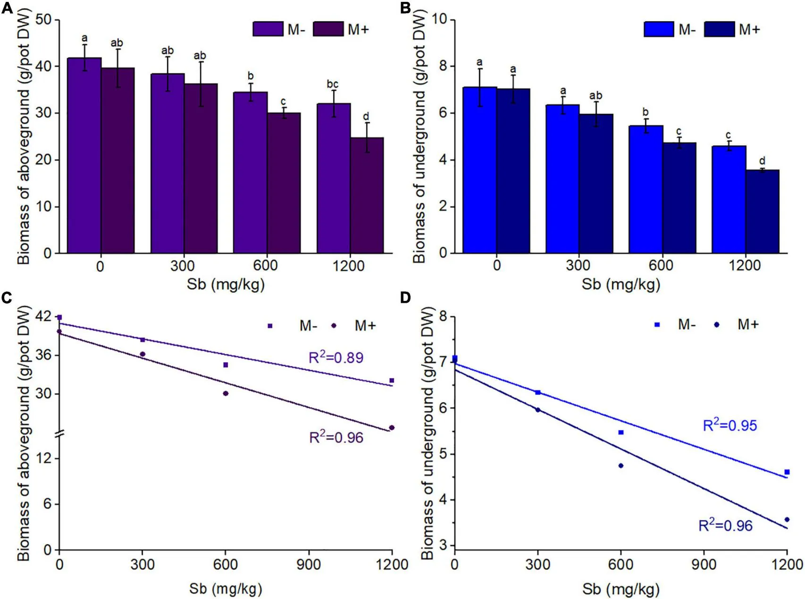

Link to my github: [GitHub Repository](https://github.com/herreralinda847/ENVS-193DS_homework-03)

## Part 1. Set up tasks

```{r}
#| label: libraries and data
#| message: false
library(tidyverse) # general use
library(janitor) # cleaning data frames
library(here) # file/folder organization
library(readxl) # reading .xlsx files
library(ggeffects) # generating model predictions
library(gtsummary) # generating summary tables for models
library(ggplot2) # making ggplots 
library(viridisLite)
library(flextable)

# read in data as object "salinity"
salinity <- read.csv(here("data", "salinity-pickleweed.csv"))
# read in personal data as object 
my_data <- read_xlsx(here("data", "ENVS193_personal_data.xlsx"))
```

## Part 2. Problems

### Problem 1. Slough soil salinity

#### a. An appropriate test

The two appropriate tests are Pearson's correlation coefficient (r) and Spearman's rank correlation coefficient (ρ), which both quantify the strength and direction of the relationship between two continuous variables: salinity (e.g., soil or water salinity concentration) and California pickleweed biomass (e.g., grams of dry mass). Pearson’s r tests for a linear relationship and assumes approximately normally distributed, continuous variables with independent observations, whereas Spearman’s ρ is a non-parametric, rank-based test that assesses a monotonic relationship without requiring normality.

#### b. Create a visualization

```{r}
#| label: cleaning
#| message: false
salinity_clean <- salinity |> 
  clean_names() |> 
  select(salinity_m_s_cm, pickleweed) |> 
  rename(salinity = salinity_m_s_cm,
         biomass = pickleweed)

```

##### Fit linear model

```{r}
#| label: pickleweed scatterplot
#| message: false
#| fig-height: 4
#| fig-width: 6
ggplot(data = salinity_clean, 
       aes(x = salinity,
           y = biomass)) + 
  geom_point(size = 2,
             color = "seagreen",
             alpha = 21) +
  labs(x = "Soil Salinity (mS/cm)",
       y = "California Pickleweed Biomass (g)",
       title = "Relationship between Soil Salinity and Pickleweed Biomass") +
  theme_minimal()

```

#### c. Check your assumptions and run your test

##### • Check assumptions: linearity

```{r}
#| label: salinity scatterplot
#| message: false
#| fig-height: 4
#| fig-width: 6
ggplot(data = salinity_clean, 
       aes(x = salinity,
           y = biomass)) + 
  geom_point(size = 2,
             color = "seagreen",
             alpha = 21) +
  labs(x = "Soil Salinity (mS/cm)",
       y = "California Pickleweed Biomass (g)",
       title = "Relationship between Soil Salinity and Pickleweed Biomass") +
  theme_minimal()

```

##### • Check assumptions: normal distribution

```{r}
#| label: salinity normal distribution
#| message: false
ggplot(data = salinity_clean,
       aes(sample = salinity)) +
  geom_qq_line(color = "seagreen") +  
  geom_qq() + 
  labs(
    title = "QQ Plot of Soil Salinity",
    x = "Theoretical Quantiles",
    y = "Sample Quantiles") +
  theme_light()

```

```{r}
#| label: biomass normal distribution 
#| message: false
ggplot(data = salinity_clean,
       aes(sample = biomass)) +
  geom_qq_line(color = "seagreen") +  
  geom_qq() + 
  labs(
    title = "QQ Plot of Biomass",
    x = "Theoretical Quantiles",
    y = "Sample Quantiles") +
  theme_light()

```

To determine whether Pearson’s correlation was appropriate for testing the relationship between soil salinity (mS/cm) and California pickleweed biomass (g), I checked the assumptions of linearity and normality. I evaluated these using the scatterplot and fitting a linear model , including the Residuals vs. Fitted plot for linearity and constant variance, the Normal Q–Q plot for normality, and the Residuals vs. Leverage plot with Cook’s distance for influential points. The diagnostics indicated a linear relationship, reasonably normal residuals, constant variance, and no influential outliers, so the assumptions for Pearson’s correlation were met.

##### • Run test:

```{r}
#| label: pearson test
#| message: false
cor.test(salinity_clean$salinity, salinity_clean$biomass,
         method = "pearson")

```

#### d. Results communication

##### • Which test you used, and why:

To ensure that Pearson’s correlation was appropriate, I checked the assumptions of linearity and normality for soil salinity and pickleweed biomass. Linearity was assessed using a scatterplot of salinity versus biomass, and normality was evaluated using Q–Q plots for both variables. The plots showed an approximately linear relationship and the Q–Q plots closely followed the theoretical distribution with only minor deviations at the tails, indicating that the assumptions were reasonably met.

##### • Your interpretation of your test (along with the appropriate summary of the test in parentheses):

I found a moderate, positive linear relationship between soil salinity (mS/cm) and California pickleweed biomass (g) (Pearson’s r = 0.53, t(21) = 2.90, p = 0.01, R² = 0.29, $\alpha$ = 0.05). Biomass increased by approximately 2.08 ± 0.72 g per 1 mS/cm increase in salinity, indicating that higher soil salinity is associated with greater pickleweed biomass. This suggests that larger individuals are more likely to occur in higher-salinity soils.

#### e. Test implications

The results show that pickleweed biomass increases with soil salinity, indicating that the species performs well under more saline marsh conditions. For our restoration site, this suggests we should prioritize planting in zones that regularly receive tidal input and maintain moderate to high salinity levels. Focusing efforts in these areas will likely improve establishment and overall planting success.

#### f. Double check your own work

```{r}
#| label: test
#| message: false
cor.test(salinity_clean$salinity, salinity_clean$biomass,
         method = "spearman")

```

Both tests would lead to the same decision about the null hypothesis because both show statistically significant associations between soil salinity and pickleweed biomass (Pearson’s r = 0.53, t(21) = 2.9, p = 0.009, $\alpha$ = 0.05; Spearman’s = 0.59, S = 824, p \< 0.003, $\alpha$ = 0.05). While Spearman measures a monotonic relationship using ranked salinity and biomass values and Pearson measures a linear relationship using the raw continuous variables, both indicate a statistically significant, moderate positive relationship, meaning pickleweed biomass increases as soil salinity increases.

### Problem 2. Personal

#### a & b. Updating your visualizations & Captions

```{r}
#| label: cleaning and wrangling
#| message: false

my_data_clean <- na.omit(my_data) |> # remove all the NA's within personal data 
clean_names() |> # clean the data names
  rename(date = "date_yyyy_mm_dd", # renaming all the columns to be short and simple 
         dow = "day_of_week",
         hw = "class_homework_time_hrs", 
         bible_study = "bible_study_completed_yes_no",
         min = "minutes_of_bible_study_min",
         location = "location_home_ucen_church_building_other" ,
         time = "time_of_day", 
         with_someone = "with_someone_yes_no") |> 
  mutate(hw_mins = hw*60)

```

```{r}
#| label: figure 1
#| message: false

ggplot(data = my_data_clean, # start with the my_data_clean data frame
       aes(x = with_someone, # categorical predictor variable on the x-axis
           y = min, # response variable on the y-axis
           fill = with_someone)) + # coloring by production type
  geom_boxplot(alpha = 0.6, # first layer should be a boxplot
               width = 0.5,
               outlier.shape = NA) + 
  geom_jitter(width = 0.2, # making the points jitter horizontally
              height = 0,
              alpha = 0.5,
              size = 2,
              color = "black") + 
  stat_summary(fun = mean,
               geom = "point",
               shape = 23,
               size = 3,
               fill = "white") +
  scale_fill_manual(values = c("No" = "orangered3",
                               "Yes" = "limegreen")) +
  scale_y_continuous(limits = c(0, NA),
                     expand = expansion(mult = c(0, .05))) +
  labs(x = "With Someone (Yes/No)", # label x- and y- axes and add a title
       y = "Bible Study Devotional (mins)",
       title = "Bible Time When Studying Alone vs. With Others",
       subtitle = "Most recent observation: 25 Feb 2026") +
  theme_minimal(base_size = 12) + # change the theme 
  theme(legend.position = "none",
         panel.grid.minor = element_blank(),
         plot.title = element_text(face = "bold")) # remove the legend 

```

**Figure 1. Bible Study Duration When Alone vs. With Someone Else.** This figure shows a box-and-jitter plot of Bible study devotional time (minutes) grouped by whether the study was completed alone (No) or with someone else (Yes). Semi-transparent boxplots are filled in red (No) and green (Yes), with outliers removed from the boxplot layer. Individual daily observations are overlaid as black jittered points to display raw data distribution. White-filled diamond-shaped points represent the group means for each category.

```{r}
#| label: figure 2
#| message: false
#| fig-height: 4
#| fig-width: 6

ggplot(my_data_clean,
       aes(x = hw_mins,
           y = min,
           shape = location,
           fill = location)) +
  geom_point(size = 4,
             alpha = 0.9,
             color = "black") + 
  scale_shape_manual(values = c(21, 22, 23, 24, 25)) + 
  scale_fill_viridis_d(option = "G") +
  coord_cartesian(ylim = c(0, 130)) +
  labs(
    x = "Time spent doing Homework/Classes (mins)",
    y = "Bible Study Devotional (mins)",
    title = "Daily Homework Time vs. Bible Study",
    subtitle = "Most recent observation: 25 Feb 2026") +
  theme_light() +
  theme(
    legend.position = "right",
    plot.title = element_text(face = "bold"))

```

**Figure 2. Daily Homework Time vs. Bible Study Duration by Location.** This figure presents a scatterplot of homework/class time (minutes) on the x-axis and Bible study devotional time (minutes) on the y-axis. Each observation is plotted as a large point with a black outline and filled using a discrete viridis color palette to represent study location. The different semi-transparent point shapes (circle, square, diamond, and triangle) further distinguish locations. The legend appears on the right to identify the color and shape corresponding to each location category.

### Problem 3. Affective visualization

#### a. Describe in words what an affective visualization could look like for your personal data (3-5 sentences).

An affective visualization of my devotional time data could take the form of a countryside scene with rolling hills and sheep, inspired by imagery from the Bible. This idea comes especially from Psalm 23, which describes the Lord as a shepherd and people as His sheep—an analogy that emphasizes guidance, care, and dependence. Each hill would represent a different study location—home, church, UCEN, or other—and each day of Bible study would appear as a sheep placed on the corresponding hill. The shading of the sheep would show the amount of time spent (light for 1–60 minutes, medium for 61–90 minutes, dark for 91–120 minutes), and the sheep’s faces would indicate whether I studied alone or with someone (black-faced sheep for “yes” and white-faced sheep for “no”). At the top of the hills, a cross or a shepherd figure symbolizing Jesus could overlook the flock (Psalm 23), simply tying the whole scene back to the meaning behind my devotional time and the imagery that inspired it.

#### b. Create a sketch (on paper) of your idea

{width="517"}

#### c. Make a draft of your visualization

{width="517"}

#### d. Write an artist statement

##### • Content

This piece visualizes my devotional life during the school term by representing each day of Bible study as a sheep placed on different hills in a pastoral landscape. Each hill represents a study location, while the sheep’s shading and face color communicate the duration of study and whether I studied alone or with someone. The scene reflects how my academic workload interacts with my spiritual routine and consistency.

##### • Influences

The imagery is inspired by Psalm 23, which describes the Lord as a shepherd guiding and caring for His sheep. This metaphor shaped the decision to represent each study day as a sheep watched over by a cross or shepherd figure symbolizing Jesus Christ. I was also influenced by Dear Data by Stefanie Posavec and Giorgia Lupi, which inspired the use of personal data expressed through artistic, hand-crafted visual forms.

##### • Form

The work is presented as a digital scrapbook-style collage, combining illustrated elements such as hills, sheep, and symbolic imagery with layered textures and a cut-out graphic look. The scrapbook aesthetic allows the visualization to feel personal and reflective, similar to documenting moments in a journal.

##### • Process

I began by tracking my daily data on Bible study and academic workload. Then I designed visual symbols for each variable and assembled them into a digital countryside scene using a scrapbook collage approach—layering textures, shapes, and icons to represent my data. This process allowed the visualization to function both as a personal reflection and as a creative way of communicating patterns in my devotional habits.

#### e. Prep your materials to share in class

[View my presentation](https://docs.google.com/presentation/d/1pEiDiT0xJile2DCeZPyrQXxcZLEhZ-Sv97qOKm3Azfc/edit?usp=sharing) 

### Problem 4. Statistical critique

#### a. Revisit and summarize

The authors used two-way ANOVA and Student’s t-tests to compare rice plants with and without AMF across different antimony levels. Antimony concentration and AMF presence were the independent variables, while plant growth, antimony uptake, and enzyme activity were the dependent variables. 

{width="517"}

#### b. Visual clarity

The authors visually represent their statistics clearly across the figure panels. In panels A and B, Sb concentration is on the x-axis and biomass (dry weight) on the y-axis, logically presenting the independent and dependent variables; the bar graphs show mean values with SD error bars and use colors to distinguish M− and M+ treatments, with letters indicating significant differences (P < 0.05). Panels C and D include individual data points with regression lines and R² values, which clearly illustrate the negative relationship between Sb concentration and biomass. However, the bar charts do not show the raw data points and the small sample size (n = 3) limits how fully variability can be assessed.

#### c. Aesthetic clarity

The authors handle visual clutter well by keeping the figure design relatively simple despite presenting multiple variables. Most of the ink in the figure represents meaningful data elements—such as bars, points, regression lines, and error bars—rather than unnecessary decorative features, resulting in a high data-to-ink ratio. The use of a plain background, clear axes, and limited colors helps distinguish treatments (M− and M+) without overwhelming the viewer. Overall, the figure remains readable while still presenting information on both aboveground and underground biomass across Sb concentrations.

#### d. Recommendations

I would recommend adding individual data points to the bar graphs in panels A and B so readers can see the distribution rather than only the mean ± SD, which would improve transparency. The figure could also standardize colors across panels (e.g., keep the same color for M- and M+ in all panels) to make the treatment comparisons easier to follow visually. The y-axis labeling on panel C could be more clearly indicated by going up by the same increments. The axis break could make the changes in the biomass appear larger or smaller than they are.


